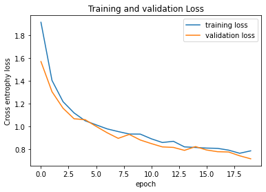

# Sentiment_analysis
To analyse movie comments to determine whether it is positive or negative comment

# Description
This is a project to analyse movie review comments in text, and predict the review is a positive or negative sentiment

# How to use it
close repo and run it
train.py is a script to train the data
deploy.py is a script for deployment

# Credit
file used from ANkit152
https://raw.githubusercontent.com/Ankit152/IMDB-sentiment-analysis/master/IMDB-Dataset.csv

# Images

